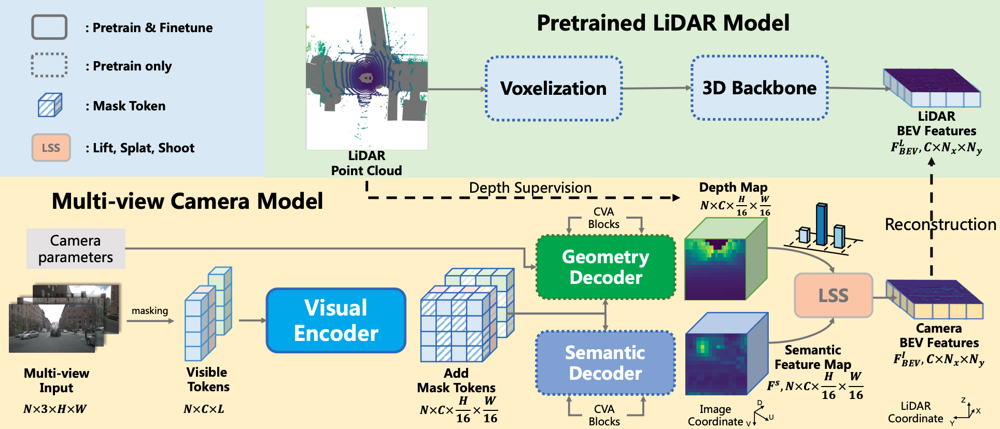

# GeoMIM: Towards Better 3D Knowledge Transfer via Masked Image Modeling for Multi-view 3D Understanding (ICCV 2023)

<h3 align="center">
  <a href="https://arxiv.org/abs/2303.11325">arXiv</a>
</h3>



## Introduction

Welcome to the official repository of [GeoMIM](https://arxiv.org/2303.11325), a groundbreaking pretraining approach for multi-view camera-based 3D perception. This repository provides the pretraining and finetuning code and pretrained models to reproduce the exceptional results presented in our paper.

The implementation of pretraining is based on [bevfusion](https://github.com/mit-han-lab/bevfusion). See the `pretrain` folder for further details.

After pretraining, we finetune the pretrained Swin Transformer for multi-view camera-based 3D perception. We use the [BEVDet](https://github.com/HuangJunJie2017/BEVDet) for finetuning. We provide models with different techniques used in [BEVDet](https://github.com/HuangJunJie2017/BEVDet), including CBGS, 4D, Depth, and Stereo. We also provide models for occpancy prediction using the implementation in BEVDet repo. See the `bevdet` folder for further details.

## Key Results

We provide the GeoMIM pretrained Swin-Base and Large checkpoints.
| Model | Download | 
| ------ | ---- | 
| Swin-Base | [Model](https://drive.google.com/file/d/1bHp4Y4j8X4LRoi8n7PRYskFohYq_J2X8/view?usp=sharing) |
| Swin-Large | [Model](https://drive.google.com/file/d/1lMdkAV0MTbBkR4YzsyPPGg0EkB5vLTVG/view?usp=sharing) |

We have achieved strong performance on the nuScenes benchmark with GeoMIM. Here are some quantitative results on 3D detection:

| Config | mAP | NDS | Download |	
| ------ | --- | --- | ----- |
| [bevdet-swinb-4d-256x704-cbgs](bevdet/configs/bevdet_geomim/bevdet-swinb-4d-256x704-cbgs.py) | 33.98 | 47.19 | [Model](https://drive.google.com/file/d/1sNn6kdgdIUQwUZQvywvtszEHTrStsDFQ/view?usp=sharing) |
| [bevdet-swinb-4d-256x704-cbgs-geomim](bevdet/configs/bevdet_geomim/bevdet-swinb-4d-256x704-cbgs-geomim.py) | 42.25 | 53.1 | [ckpt](https://drive.google.com/file/d/1xJ77En6Aa_gYDu1IEAtx_t8gdS3MCici/view?usp=sharing) |
| [bevdet-swinb-4d-stereo-256x704-cbgs-geomim](bevdet/configs/bevdet_geomim/bevdet-swinb-4d-stereo-256x704-cbgs-geomim.py) | 45.33 | 55.1 | [Model](https://drive.google.com/file/d/1v-YXOJ-VLuCS-WrnJHfmA_YKgWshjMe2/view?usp=sharing) |
| [bevdet-swinb-4d-stereo-512x1408-cbgs](bevdet/configs/bevdet/bevdet-stbase-4d-stereo-512x1408-cbgs.py) | 47.2 | 57.6 | [Model](https://pan.baidu.com/s/1237QyV18zvRJ1pU3YzRItw?pwd=npe1) (#) |
| [bevdet-swinb-4d-stereo-512x1408-cbgs-geomim](bevdet/configs/bevdet_geomim/bevdet-swinb-4d-stereo-512x1408-cbgs-geomim.py) | 52.04 | 60.92 | [Model](https://drive.google.com/file/d/1AZTjIrO0G1huecHx5PzJNgReVGCo1JdC/view?usp=sharing) |

Here are some quantitative results on occpancy prediction:

| Config | mIoU | Download |	
| ------ | ---- | ----- |
| [bevdet-occ-swinb-4d-stereo-2x](bevdet/configs/bevdet_occ/bevdet-occ-stbase-4d-stereo-512x1408-24e.py) (*) | 42.0 | [Model](https://pan.baidu.com/s/1237QyV18zvRJ1pU3YzRItw?pwd=npe1) (#) |
| [bevdet-occ-swinb-4d-stereo-2x-geomim](bevdet/configs/bevdet_geomim/bevdet-occ-swinb-4d-stereo-512x1408-24e-geomim.py) | 45.0 | [Model](https://drive.google.com/file/d/1qH5UalLpXueglGhEfCo58hi85LBilSMa/view?usp=sharing) |
| [bevdet-occ-swinb-4d-stereo-2x-geomim](bevdet/configs/bevdet_geomim/bevdet-occ-swinb-4d-stereo-512x1408-24e-geomim-load.py) (*) | 45.73 | [Model](https://drive.google.com/file/d/11Qi8BgJaPI4YU4q1XQ963WvwBYqx_EbY/view?usp=sharing) |
| [bevdet-occ-swinl-4d-stereo-2x-geomim](bevdet/configs/bevdet_geomim/bevdet-occ-swinl-4d-stereo-512x1408-24e-geomim.py) | 46.27 | [Model](https://drive.google.com/file/d/1tqb_CE4tIN1tsuD4tEimdurFXbLsMzzB/view?usp=sharing) |

(*) Load 3D detection checkpoint.
(#) Original BEVDet checkpoint.


## Get Start

- [Pretraining on nuscenes dataset](pretrain)
- [Finetuning on 3D detection task](bevdet)
- [Finetuning on occpancy prediction task](bevdet)


## Citation

If you find GeoMIM beneficial for your research, kindly consider citing our paper:

```
@inproceedings{liu2023geomim,
  title={GeoMIM: Towards Better 3D Knowledge Transfer via Masked Image Modeling for Multi-view 3D Understanding},
  author={Jihao Liu, Tai Wang, Boxiao Liu, Qihang Zhang, Yu Liu, Hongsheng Li},
  booktitle={Proceedings of the IEEE/CVF International Conference on Computer Vision (ICCV)},
  year={2023}
}
```


## Contact

For any questions or inquiries, please feel free to reach out to the authors: [Jihao Liu](https://jihaonew.github.io/) ([email](mailto:jihaoliu@link.cuhk.edu.hk)) and [Tai Wang](https://tai-wang.github.io/) ([email](mailto:taiwang.me@gmail.com))
